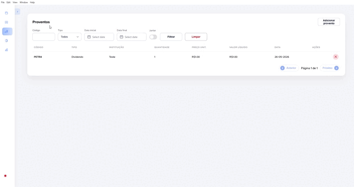

<h1 align="center">📈 Ações Brasil</h1>

<p align="center">
  <b>Gerenciador de carteira de investimentos para a Bolsa de Valores Brasileira (B3)</b>
</p>

<p align="center">
  
  
  
  
  
  
  
  
  
  
  
</p>

## 🚀 Sobre

Aplicação **full-stack** para controle de ordens (compra/venda), proventos, portfólio e indicadores fundamentalistas de ativos brasileiros (ações, FIIs, BDRs). Interface web com **Angular 21 + SSR** e versão desktop via **Electron**.

<p align="center">
  
</p>

## ✨ Funcionalidades

| Funcionalidade | Descrição |
|---|---|
| 📊 **Ordens** | Cadastro, listagem e exclusão de ordens de compra/venda. Importação de relatórios Excel (.xlsx) |
| 💼 **Portfólio** | Carteira consolidada com preço médio, quantidade total e saldo atualizado por ativo |
| 💰 **Proventos** | Registro de dividendos, JCP e rendimentos. Importação de relatórios Excel |
| 🔍 **Fundamentus** | Indicadores fundamentalistas obtidos via web scraping |
| 📈 **Google Finance** | Cotações em tempo real e gráfico de preços |
| 📤 **Exportação** | Exportação de snapshots de venda para Excel |
| 🖥️ **Desktop** | Versão empacotada com Electron |

## 🏗️ Stack

| Camada | Tecnologia |
|---|---|
| **Frontend** | Angular 21, Signals, RxJS, SCSS, Vitest |
| **Backend** | Node.js, Express 5, TypeScript |
| **Banco** | SQLite (dev), SQL Server (prod), Sequelize ORM |
| **Desktop** | Electron 41 |
| **Testes** | Jest (back), Vitest (front), Supertest |
| **Análise** | SonarQube |
| **Fontes de dados** | Fundamentus, Google Finance |
| **Container** | Docker / Docker Compose |

## 📁 Estrutura

```
acoes/
├── back/              API REST (Express + Sequelize)
│   └── src/
│       ├── application/    Casos de uso (services + DTOs)
│       ├── controllers/    Handlers HTTP
│       ├── domain/         Entidades e regras de negócio
│       ├── infrastructure/ Repositórios e serviços externos
│       ├── routes/         Definição de rotas Express
│       └── shared/         Utilitários, DI, logger
├── front/             Aplicação Angular
│   └── projects/app/src/
│       ├── components/     Componentes reutilizáveis
│       ├── pages/          Páginas (ordens, portfólio, proventos, etc.)
│       ├── services/       HTTP + estado reativo (Signals)
│       └── models/         Modelos de frontend
├── common/             Modelos e utilitários compartilhados
├── electron/           Wrapper desktop (Electron)
├── dockers/            Docker Compose (SQL Server)
├── rules/              Convenções do projeto
├── PRD/                Documentos de requisitos
└── PLAN/               Planos de execução
```

## 🌐 API

### Ordens

| Método | Rota | Descrição |
|---|---|---|
| `POST` | `/orders` | Criar ordem |
| `GET` | `/orders` | Listar ordens (paginado) |
| `DELETE` | `/orders/:id` | Excluir ordem |
| `POST` | `/orders/import` | Importar ordens via Excel |
| `GET` | `/orders/export/sell-snapshots` | Exportar snapshots de venda (Excel) |

### Portfólio

| Método | Rota | Descrição |
|---|---|---|
| `POST` | `/portfolios` | Criar/atualizar item do portfólio |
| `GET` | `/portfolios` | Listar portfólio |
| `DELETE` | `/portfolios/:id` | Excluir item do portfólio |

### Proventos

| Método | Rota | Descrição |
|---|---|---|
| `POST` | `/proventos` | Criar provento |
| `GET` | `/proventos` | Listar proventos (paginado) |
| `DELETE` | `/proventos/:id` | Excluir provento |
| `POST` | `/proventos/import` | Importar proventos via Excel |

### Outros

| Método | Rota | Descrição |
|---|---|---|
| `GET` | `/health` | Health check |
| `GET` | `/fundamentus/:codigo` | Dados fundamentalistas |
| `GET` | `/google-finance/:codigo` | Cotações e gráfico do Google Finance |

## ⚡ Como rodar

### Desenvolvimento

```bash
# Instalar dependências
npm install
npm --prefix back install
npm --prefix front install

# Backend (SQLite)
npm run dev:back:sqlite

# Frontend
npm run dev:front

# Desktop (tudo junto)
npm run dev:desktop:app
```

### Testes

```bash
npm run coverage:back   # Jest (backend)
npm run coverage:front  # Vitest (frontend)
```

### Build produção

```bash
npm run start:app
```

## 📋 Requisitos

- **Node.js** >= 18
- **NPM** 10+
- **SQL Server** (produção) via Docker ou instância própria

## 🏷️ Ativos suportados

| Tipo | Sufixo do ticker | Exemplo |
|---|---|---|
| **Ação** | 3, 4, 5, 6, 11 | `PETR4` |
| **FII** (Fundos Imobiliários) | 11 | `HGLG11` |
| **BDR** (Brazilian Depositary Receipts) | 31-35, 39 | `MELI34` |
